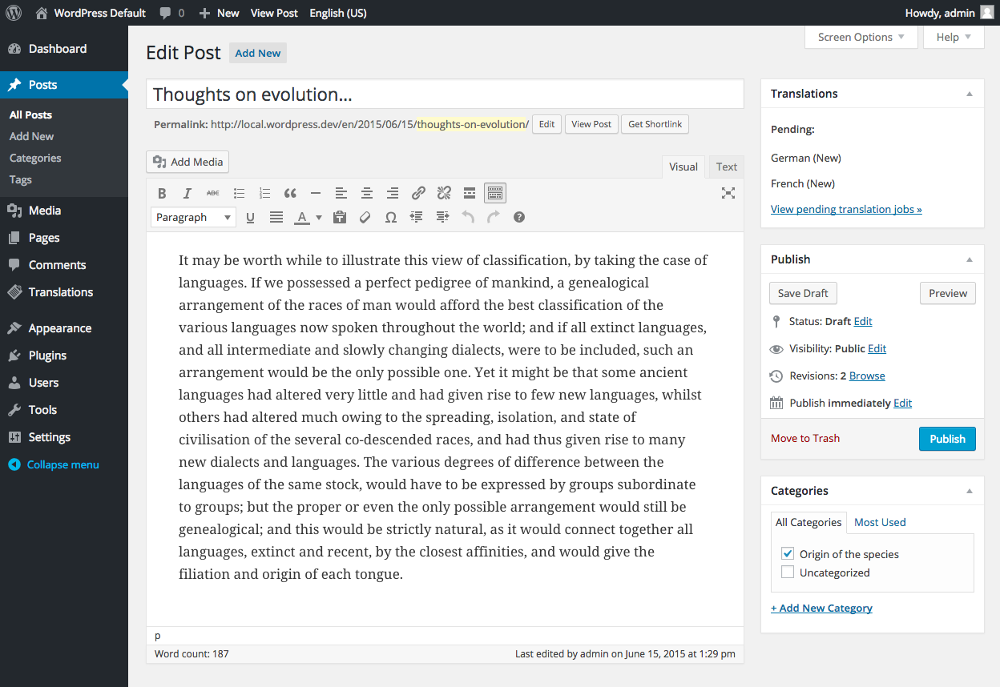
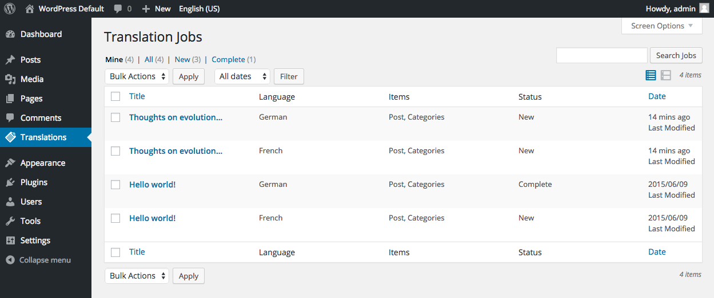
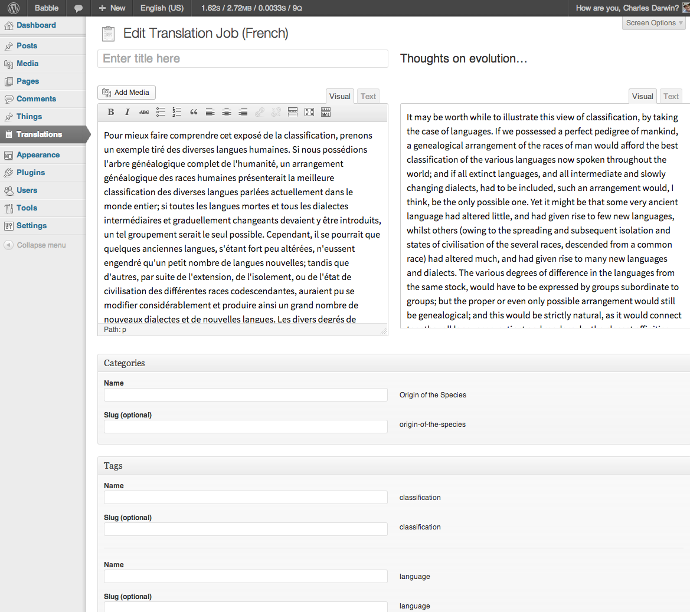

# Babble

* Tags: translations, translation, multilingual, i18n, l10n, localisation
* Requires at least: 3.5.1
* Tested up to: 3.6.1
* Stable tag: 1.4.2
* License: GPLv2 or later
* License URI: http://www.gnu.org/licenses/gpl-2.0.html

Multilingual WordPress done right.

## Description

This plugin is at a beta stage for translating:

 * Posts
 * Pages
 * Custom post types
 * Categories
 * Tags
 * Custom taxonomies.

It is powering a live site at http://freespeechdebate.com/.

The plugin was built with an aversion to both additional database tables, additional columns 
or column changes and a desire to keep additional queries to a minimum. The plugin is (in theory)
compatible with WordPress.com VIP and was built with this platform in mind.

There are a **lot** of `@FIXME` comments, expressing doubts, fears, uncertainties and 
unknowns; feel free to weigh in on any of them.

Please add bugs and contribute patches and pull requests to https://github.com/cftp/babble/issues

Contributors: Simon Wheatley, John Blackbourn, Scott Evans, Simon Dickson, Marko Heijnen, Tom Nowell, Gary Jones, Emyr Thomas

## Installation

Installation is fairly standard:

1. Upload the `babble` directory to the `/wp-content/plugins/` directory
2. Ensure pretty permalinks are activated in Settings -> Permalinks, not sure how it will cope without these!
3. Activate the plugin through the 'Plugins' menu in WordPress
4. You'll now be prompted to set the languages you want, you can pick from any of the language packs you've got installed
5. You'll notice the language switcher menu in the admin bar, use this to switch languages and (depending on context) to create new versions of the content you are looking at (from the front end) or editing (from the admin area)

## Screenshots

     
_Trigger a translation from the post edit screen_

     
_View the jobs in the translation queue_

     
_Add the translation on the translation editor_

## Changelog

### 1.4.2

* Fix the language switcher widget so it correctly displays language names

### 1.4.1

* Add the External Update API library to serve updates to Babble from GitHub

### 1.4

* ENHANCEMENT: Translation job UI and workflow
* ENHANCEMENT: Separation of admin language setting from the content language
* Various fixes and enhancements

*gap of time while we add various things*

### alpha 1.1 

* Taxonomy terms.

### alpha 1 

* Proof of concept concentrating on the translation of posts. Taxonomies and menus are not handled yet. Widgets are out of scope completely for this phase of work.
