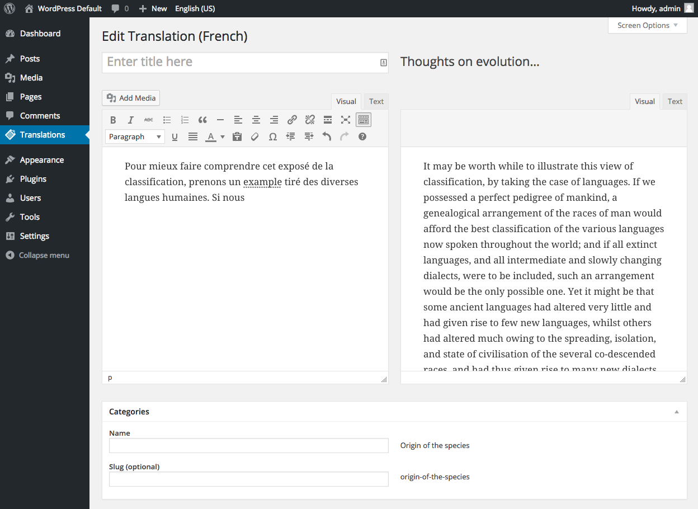

# Babble

* Tags: translations
* Requires at least: 3.5.1
* Tested up to: 3.5.1
* Stable tag: Stable tag: Beta 1.3
* License: GPLv2 or later
* License URI: http://www.gnu.org/licenses/gpl-2.0.html

A plugin to handle translating content into a variety of languages.

## Description

This plugin is at a beta stage for translating post type content for the built
in types of `post` and `page`. It is powering a live site at http://freespeechdebate.com/.

The plugin was built with an aversion to both additional database tables, additional columns 
or column changes and a desire to keep additional queries to a minimum.

There are a **lot** of `@FIXME` comments, expressing doubts, fears, uncertainties and 
unknowns; feel free to weigh in on any of them.

Please add bugs and contribute patches and pull requests to https://github.com/cftp/babble/issues

Contributors: Simon Wheatley, John Blackbourn, Scott Evans, Simon Dickson, Marko Heijnen

## Installation

Installation is fairly standard:

1. Upload the `babble` directory to the `/wp-content/plugins/` directory
1. Activate pretty permalinks in Admin > , not sure how it will cope without these!
1. Copy the contents of `languages` into `wp-content/languages/` (optional, but makes it easier to see when languages have been switched)
1. Activate the plugin through the 'Plugins' menu in WordPress
1. You'll now be prompted to set the languages you want, you can pick from any of the language packs you've got installed
1. You'll notice the language switcher menu in the admin bar, use this to switch languages and (depending on context) to create new versions of the content you are looking at (from the front end) or editing (from the admin area)

## Screenshots

     
_Trigger a translation from the post edit screen_

     
_View the jobs in the translation queue_

     
_Add the translation on the translation editor_

## Changelog

### beta 1.3 

* ENHANCEMENT: Translation job UI and workflow
* ENHANCEMENT: Separation of admin language setting from the language of the post in the editor
* Various fixes and enhancements

### alpha 1.2 

*gap of time while we add various things*

### alpha 1.1 

* Taxonomies.

### alpha 1 

* Proof of concept concentrating on the translation of posts. Taxonomies and menus are not handled yet. Widgets are out of scope completely for this phase of work.

